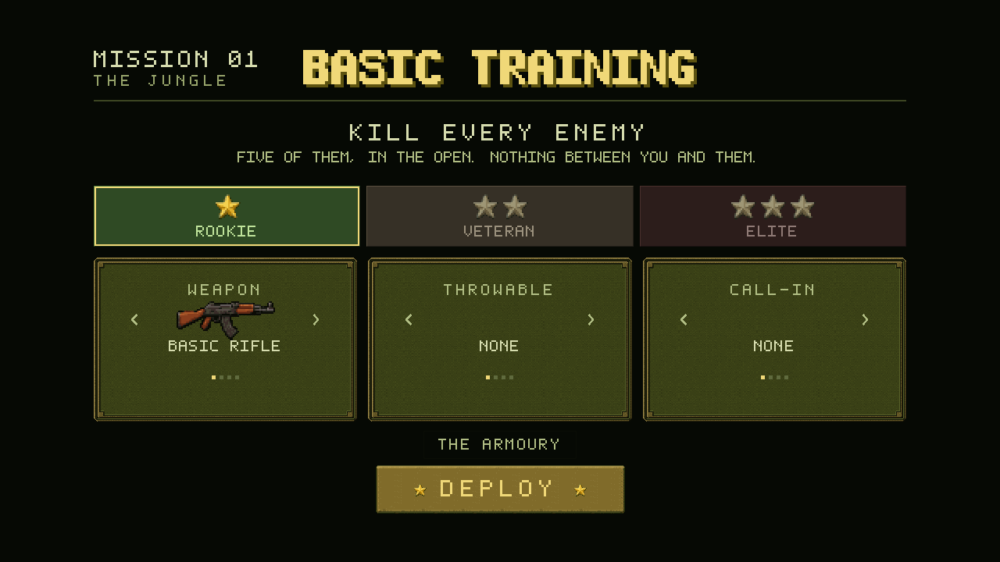

# Boots & Bullets — offline mirror

Full mirror of **Boots & Bullets** (bootsandbullets.com): a pixel-art WW2-platoon
tactics game — squads, orders, grenades, call-ins (airstrike/smoke), enemy
flanking AI, hold-position and assassinate objectives, a campaign with
briefings, War Bonds upgrades, andWebSocket multiplayer (public/private lobbies
with join codes). Single self-contained `bundle.js`, PWA installable, includes
`press-kit/` and its own hand-written `hq/track.js` music engine.

Source: https://bootsandbullets.com/

## Layout

- `index.html`, `bundle.js`, `style.css`, `icons/`, `music/`, `manifest.webmanifest` — served files, byte-exact
- `hq/track.js` — the site's own hand-written music-track player (kept as-is)
- `press-kit/` — the author's press kit page
- `readable/bundle.pretty.js` — prettified view of the raw bundle (23,979 lines)
- `readable/bundle.deob.js` / `bundle.deob.pretty.js` — **deobfuscated view**: the
  obfuscator.io string-array protection (decoder `b`, rotator IIFE, `cX` aliases)
  resolved by `tools/deobfuscate.mjs`, which runs the array in a VM and inlines
  all 20,736 encoded-string calls. Every string in this view reads literally.
- `src/` — 15 readable slices cut from the deobfuscated view via `split-spec.json`:

| Slice | Contents |
|---|---|
| `00-obfuscator-runtime` | string array, decoder, rotator (still load-bearing in the mirror) |
| `01-changelog` | version history (0.3.0, 2026-09-12) |
| `02-advisor-strings` | loading quips, key labels |
| `03-audio` | AudioContext, ambience/music/sfx, oscillator effects |
| `04-value-noise` | seeded value-noise terrain generator |
| `05-unit-palettes` | per-faction sprite colour tables |
| `06-asset-loading` | boot stages, atlas decode |
| `07-ui-widgets` | DOM UI framework, modals, briefing screens |
| `08-multiplayer-net` | WebSocket client (`ii` class), dial/retry, join codes |
| `09-lobby` | room listing, leaderboard |
| `10-sprite-renderer` | terrain/decal/fog canvas layers |
| `11-map-data` | string-array data: ASCII mission maps, soldier surnames, briefing text |
| `12-soldier-model` | soldier state template, spawn factory, faction helpers |
| `13-simulation` | combat, AI, orders, objectives |
| `14-hud-loop` | loadout HUD, mission results, bootstrap |

## Multiplayer note

The live game dials `ws(s)://<host>/ws`. Offline, that lands on the static
server and fails gracefully (the netcode has its own retry cap). The campaign
is fully playable offline.

## Updating

```
node tools/update.mjs          # probe live site, report drift, pull if changed
node tools/deobfuscate.mjs     # re-decode (after any bundle refresh)
node tools/split.mjs           # re-cut src/ from the spec
node tools/verify.mjs          # byte-exact check
```

This site is a single hand-rolled bundle (no build-hash churn) and the author
versions releases in the changelog — the update tool compares the bundle hash
plus the `changelog` version string, so a no-change probe is one HEAD-ish
request.


